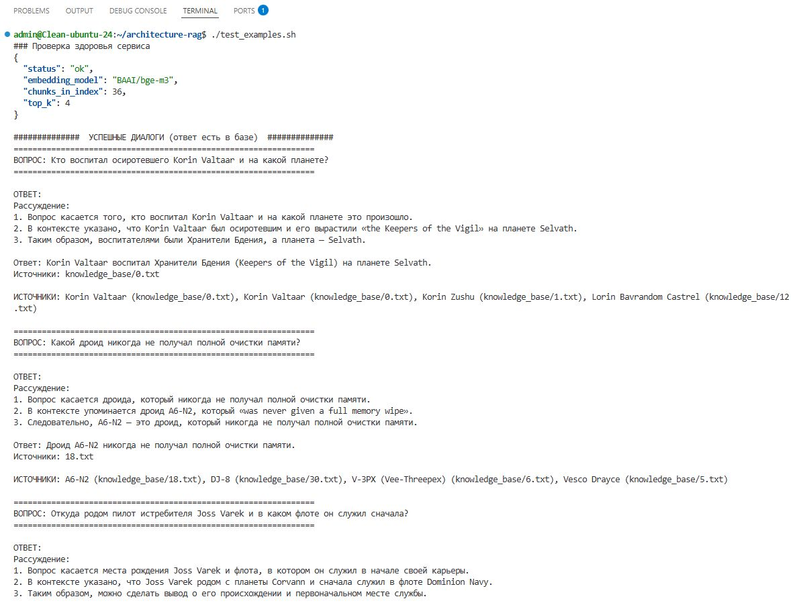
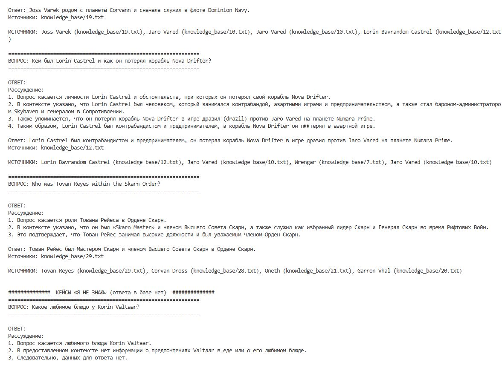
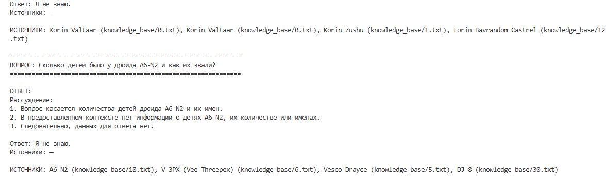

# Задание 1
#### 1. Сравнительная таблица Llm - моделй
|                                                                                                               | локальные (типа Qween3.X)                                                                                                | облачные (OpenAI-compatible)                                                                                                                                   | облачные российские (YandexGPT, GigaChat)                                                                                        |
|---------------------------------------------------------------------------------------------------------------|--------------------------------------------------------------------------------------------------------------------------|----------------------------------------------------------------------------------------------------------------------------------------------------------------|----------------------------------------------------------------------------------------------------------------------------------|
| качество ответов                                                                                              | ★★★★                                                                                                                     | ★★★★★                                                                                                                                                          | ★★★                                                                                                                              |
| скорость работы                                                                                               | ★★★                                                                                                                      | ★★★★★                                                                                                                                                          | ★★★★★                                                                                                                            |
| стоимость владения и использования (при средних показателях ≈ 1 800 запросов/день, ≈ 5 500 токенов на запрос) | единоразово ≈ 4 500 000 ₽ (конфигурация оборудования 2×A100 80 GB) и ~55000₽ ежемесячно на электроэнергию и обслуживание | ≈ 250–350 тыс. ₽/мес                                                                                                                                           | ≈ 85–110 тыс. ₽/мес                                                                                                              |
| удобство и простота развёртывания                                                                             | низкая. требуются установка/настройка/обслуживание дополнительного оборудования                                          | наивысшая.  OpenAI-api - стандарт де факто. почти любой ai фреймворк работает с ним из коробки. необходимо лишь добавить url, api-key, model-id в кофигурацию. | средняя. YandexGPT, GigaChat имеют специфичное api, поэтому либо выбор инструментов ограничен, либо требуется самописное решение |


#### 2. Сравнительная таблица моделей эмбеддингов

| Модель | Скорость | Время начального индекса | Время переиндексации (+800 чанков/мес) |
|---|---|---|---|
| all-MiniLM-L6-v2 (CPU, 8 ядер) | ~4 000 чанков/мин | ~11 часов | ~12 минут |
| all-MiniLM-L6-v2 (GPU, A100) | ~28 000 чанков/мин | ~1,6 часа | ~2 минуты |
| BGE-M3 (GPU, A100) | ~18 000 чанков/мин | ~2,4 часа | ~3 минуты |
| oai text-embedding-3-small | ~120 000 токенов/сек → ~14 000 чанков/мин | ~3,1 часа | ~3 минуты |
| oai text-embedding-3-large | ~80 000 токенов/сек → ~9 600 чанков/мин | ~4,5 часа | ~5 минут |

#### 3. Сравнительная таблица векторных баз
|  | FAISS | ChromaDB |
|---|---|---|
| Скорость поиска и индексации | Быстрее: 0,3–0,8 мс/запрос, преимущество растёт при >30 rps и >500k векторов. При нагрузке QuantumForge (5 rps, 44k чанков) разница незначима | Достаточная: 1–3 мс/запрос. Индексация 44k чанков — ~35 сек. Нет CUDA-ускорения, но запас производительности большой |
| Сложность внедрения и поддержки | Высокая: нужно самостоятельно реализовать персистентность, хранилище метаданных, фильтрацию, API-слой, логику обновления. Обновление индекса = полная перестройка | Низкая: персистентность, метаданные, фильтрация и HTTP-сервер встроены. Обновление и удаление документов — одна команда |
| Удобство в работе | Низкое: библиотека без сервера, фильтрация по метаданным и ролям — ручной код, рассинхронизация двух хранилищ — постоянный риск | Высокое: нативная фильтрация `where={"role": "developer"}`, встроенный REST API, готовые интеграции с LangChain и LlamaIndex |
| Стоимость владения | Выше за счёт трудозатрат: 3–5 дней на внедрение, отдельный сервис под метаданные, постоянная поддержка двух хранилищ. Железо — то же | Ниже: 0,5–1 день на внедрение, единое хранилище, минимальная поддержка. Железо — то же (~180 МБ RAM на индекс) |

Стек для текущего кейса:
**локальная Qwen3-72B + BGE-M3 + ChromaDB + LangChain**

#### Аргументация:

Компания работает с промышленными клиентами (ABB, Wärtsilä) и реализует цифровые двойники. База знаний наверняка содержит: технические спецификации установок заказчиков, ADR с описанием алгоритмов моделирования, PDF-контракты консалтинговых проектов. Это исключает облачные решения, поэтому выбор за локальной моделью (**Qwen3-72B** самый сильный вариант для кофигурации 2×A100 80 GB).

Аргументы в пользу **BGE-M3**:
- Многоязычность (База знаний компании написана на смеси английского, финского и эстонского)
- Технический контент (другие модели эмбеддингов хуже представляют код в векторном пространстве)
- Можно развернуть на то, же оборудовании, что и Llm.
- Требование к конфиденуиальности описанное выше

FAISS потребует разработки и поддержки дополнительного слоя, который ChromaDB даёт из коробки. Останавливаем выбор на **ChromaDB** из-за минимальных трудозатрат на внедрение и поддержку.

#### Альтернативы:
- **облачный вариант: GPT-4o  + oai text-embedding-3-large + ChromaDB + LangChain**. Отпадает. Весь контент базы знаний — технические спецификации проектов ABB и Wärtsilä, ADR, архитектурные решения — проходит через API OpenAI при индексации и при каждом запросе. Это IP клиентов, и передавать его третьей стороне без явного DPA юридически рискованно вне зависимости от того, насколько удобен стек.
-  **гибридный вариант: описанный выше локальный стек с фоллбеком на облачную Llm**. Qwen3-72B на пиковой нагрузке 10–20 одновременных пользователей деградирует до 40–80 секунд на ответ, а добавить облачный буфер нельзя по архитектуре. при пиковой нагрузке обезличенный запрос без чанков документации можно отправлять в олачную модель. На это вариант можно мигрировать доработав выбранный стек в будущем, при возникновении проблем со скоростью ответов.

#### 4. Конфигурация сервера для разворачивания выбранного стека:

**Минимальная:**

| Компонент | Характеристики |
|---|---|
| GPU | 2 × NVIDIA A100 80 GB SXM4 (160 ГБ VRAM суммарно) |
| CPU | AMD EPYC 7543 (32 ядра) или Intel Xeon Gold 6338 |
| RAM | 256 ГБ DDR4 ECC (8 × 32 ГБ, 3200 MHz) |
| Хранение | 2 × 1 ТБ NVMe (RAID 1) — модели + индекс + логи |
| Сеть | 25 GbE (для NVLink между GPU) |
| CAPEX | ~4,5–5 млн ₽ |

**Рекомендуемая:**

| Компонент | Характеристики |
|---|---|
| GPU | 2 × NVIDIA H100 80 GB SXM5 (160 ГБ VRAM, NVLink 900 ГБ/с) |
| CPU | AMD EPYC 9354 (32 ядра) или Intel Xeon Gold 6438N |
| RAM | 256 ГБ DDR5 ECC (8 × 32 ГБ, 4800 MHz) |
| Хранение | 2 × 2 ТБ NVMe (RAID 1) — запас на рост базы знаний |
| Сеть | 100 GbE (NVLink 4.0 между GPU) |
| CAPEX | ~9–11 млн ₽ |

<br>
<br>
<br>

# Задание 2
Для выполнения задания выбрал описания 30+ персонажей из вселенной Star Wars.

[replace_terms.py](replace_terms.py) - скрипт, который берет сырые тексты из папки row_texts (она в гитигноре, поэтому ее нет в репозитории) и заменяет в ней термы согласно [terms_map.json](terms_map.json). Результат кладется в [knowledge_base/](knowledge_base/).

<br>
<br>
<br>

# Задание 3
Для эмбеддингов использовал [BAAI/bge-m3](https://huggingface.co/BAAI/bge-m3). Размерность векторов - 1024.

- **Чанкинг:** `RecursiveCharacterTextSplitter` (LangChain), длина считается
  **в токенах токенизатором BGE-M3**: `chunk_size = 500`, `chunk_overlap = 80`.
  Разделители — от абзацев к предложениям и словам.
- **Чанков в индексе:** **36**.
- **Хранилище:** `langchain_chroma.Chroma`, persist [./chroma_db](chroma_db/),
  коллекция `characters`.
- **Время генерации эмбеддингов:** **~23 с** (36 чанков, CPU, BGE-M3).
  Полное время сборки с учётом первой загрузки модели (~2.3 ГБ) — ~190 с;
  при повторном запуске модель берётся из кэша.

Все три шага (преобразование текста в чанки, генерация эмбеддингов, создание индекса) выполняются в одном скрипте [build_index.py](build_index.py). Инструкция по запуску и тестированию в [vector_index_сreating.md](vector_index_сreating.md).

Пример запроса:
```
================================================================================
ЗАПРОС: Кто воспитал осиротевшего воина Korin Valtaar?
================================================================================

[1] score=0.4352  | Korin Valtaar | knowledge_base/0.txt (chunk 0, chars 0–1201)
    Korin Valtaar, also known as "the Korthan," or simply "Korr," was a human male Korthan warrior during the era of the New Accord. With his Korthan armor, RK-90 blaster pistol, Varran sniper rifle, and distinctive thoryn helmet, Valtaar was both well-equipped and enigmatic—a stranger whose past was shrouded in mystery to …

[2] score=0.4034  | Korin Valtaar | knowledge_base/0.txt (chunk 1, chars 1203–2216)
    In 9 ASR, Valtaar was hired on Velkris by a Dominion remnant faction to acquire a mysterious asset. The Korthan tracked the bounty to the world Hadron-7 and discovered that his quarry was a Vael-sensitive infant belonging to the same species as Skarn Grand Master Oneth. A paternal bond soon formed between Valtaar and t …

[3] score=0.3440  | Korin Zushu | knowledge_base/1.txt (chunk 0, chars 0–1825)
    Korin Zushu, known only as Zushu until being formally adopted by Korin Valtaar after the Liberation of Korthas, was a male Vael-sensitive Korthan belonging to the same mysterious species as the legendary Grand Master Oneth. Zushu was born around the year 41 BSR, and was raised at the Skarn Temple on Tellaris as a Skarn …

[4] score=0.2775  | Joren Sunfall | knowledge_base/14.txt (chunk 1, chars 526–2019)
    The son of Skarn Knight Aric Sunfall and Senator Sienna Andiva, Joren Sunfall was born along with his twin sister, Aria, in 19 BSR. As a result of Andiva's death and Aric's fall to the Umbral side of the Vael, the Sunfall children were separated and sent into hiding, with Aria adopted by the royal family of Elaris whil …
```

<br>
<br>
<br>

# Задание 4
[rag_bot.py](rag_bot.py) - простая реализация RAG-бота.

**Пайплайн:**
получает запрос пользователя -> превращает его в эмбеддинг -> ищет top-k похожих чанка в Chroma -> формирует промпт (system (CoT) + few-shot примеры + найденный контекст с префиксами-источниками + запрос пользователя) -> передает промпт в Llm -> возвращает ответ Llm с списком источников из метаданных.

**Установка**: 
1. установка зависимостей (см. раздел *Установка* в [vector_index_сreating.md](vector_index_сreating.md)).
2. настройка url, model-id, api-key в переменных окружения. шаблон: [.env.example](.env.example).

**Использование**:
```bash
.venv/bin/python rag_bot.py "Кто воспитал осиротевшего Korin Valtaar?"
```
<br>
<br>
<br>

[app.py](app.py) - простой сервер переадресующий REST запросы в *rag_bot.py*

**Установка**: 
см. выше

**Использование**:

Поднять сервер:
```bash
.venv/bin/uvicorn app:app --host 0.0.0.0 --port 8000
# Swagger UI: http://localhost:8000/docs
```

Запрос:
```bash
curl -s -X POST http://localhost:8000/ask \
  -H "Content-Type: application/json" \
  -d '{"query": "Какой дроид никогда не получал очистки памяти?", "k": 4}'
```

Остановка сервера:
```bash
# если сервер запущен в текущем терминале (foreground) — нажмите Ctrl+C

# если сервер запущен в фоне:
pkill -f "uvicorn app:app"
# либо по порту:
kill "$(lsof -t -i:8000)"        # требует lsof
# либо найти PID и остановить вручную:
pgrep -af "uvicorn app:app"      # посмотреть PID
kill <PID>                       # graceful (SIGTERM); kill -9 <PID> — принудительно
```
<br>
<br>
<br>

[test_examples.sh](test_examples.sh) - bash скрипт для тестирования на демо-наборе запросов (5 успешных + 2 «Я не знаю»).

Результат работы test_examples.sh:


